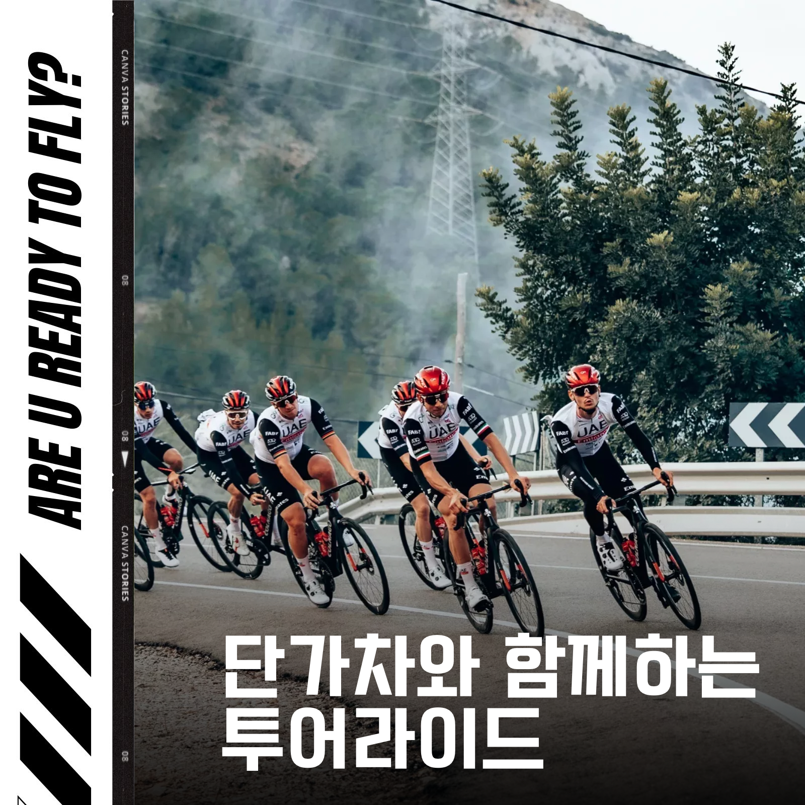
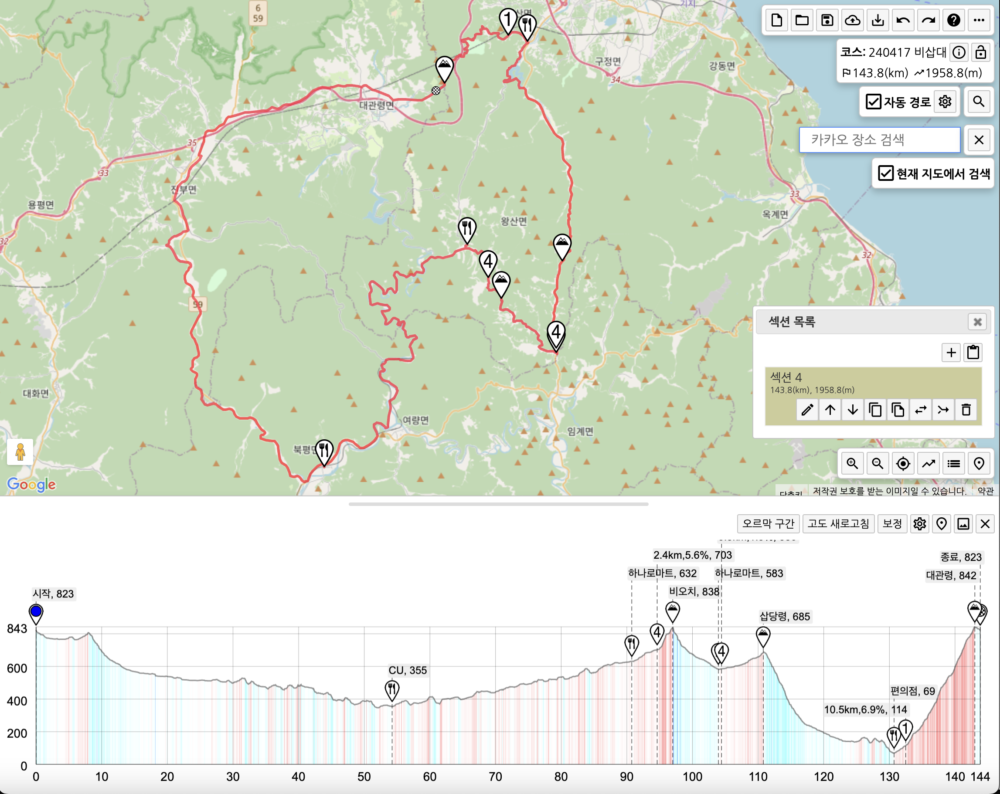

모임일시 : 4월 17일 수요일 / 07시 00분~ 

모임장소 : 대관령마을휴게소주차장

주행등급 : 초중급

인원제한 : 무제한 (숙박인원 12명)

주요코스 : 대관령 - 진부 - 여량 - 비오치 - 삽당령 - 대관령 (144K / 1958M) 

회비정산 : 1/N 

비상연락 : 010-4176-7633

코스파일: https://ridingazua.cc/c/115967

상세설명 : 

(소요시간 / 코스맵 ) 

단하👋

대관령 주차장에서 출발하여 진부 여량 일대를 돌아 삽당령 대관령을 오르는 코스입니다~!

이동거리가 144KM로 다소 길고 획고도 1959로 꾀 높은편입니다. 원점 복귀 코스이니 혹시 늦는경우에도 문제가 없겠습니다.😄 지름길도 2가지나 있습니다.

1박 후 2일차에 짧은 코스도 계획중입니다. 숙박하실분은 아래 댓글을 확인해주세요~!

### 참고

라이딩 종료 후 식당  
https://naver.me/5HEJmotp

## 다음날 새라

[용평리조트, 구절리 왕복](../용평리조트, 구절리 왕복)

### 이미지자료
