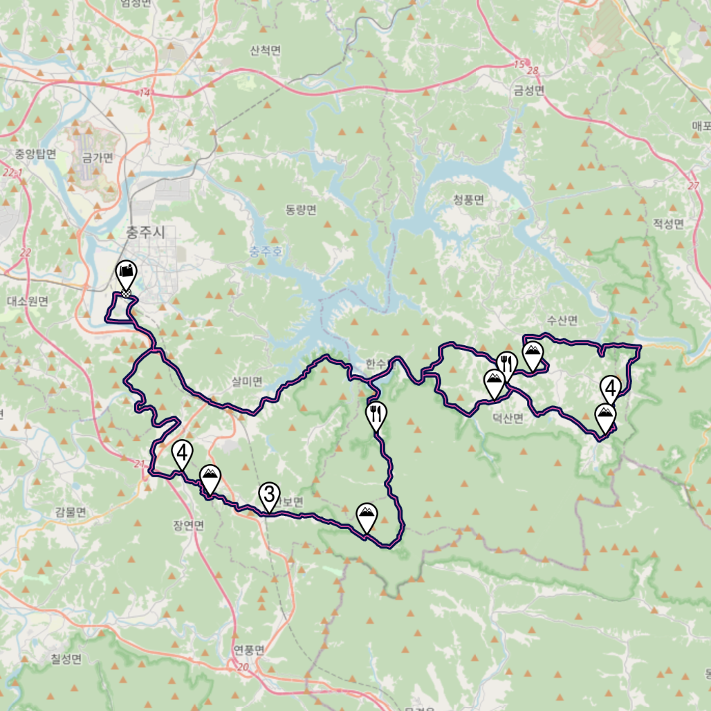
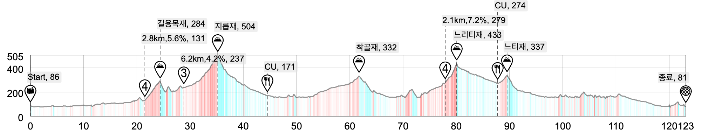

8/31(일) 충주그란폰도 사전답사 스포츠투어

🗓️모임일시 : 8월 31일 일요일 / 07시 00분~

📍모임장소 : 충주종합운동장

⚔️주행등급 : 중급

💡인원제한 : -

📱비상연락 : petermoon87(kakaotalk)

🚦운용속도 : 30-38

💞로테여부 : 선택

🛣️거리/획고 : 123KM / 1,699M

🗺️코스맵 : 하단참고

📝상세설명 :
안녕하세요~ 충주그란폰도 코스 사전답사 다녀올까합니다~(참가는 안함ㅋ)
충주그란폰도에 참가하시는 분~ 참가는 안하지만 코스타보고싶으신분~ 어여오세요~ ㅎ
그럼 레츠..꼬! 👉

💬오픈톡방운영
투어 전중후 원할한 소통을 위해 오픈채팅방을 운영하고있습니다.
https://open.kakao.com/o/gebHIpHh

💡스포츠 투어란?
- 라이딩을 신나게 하는 투어입니다.
- 인터벌없이 지속주로 이동하며 업힐은 각자 페이스대로 오릅니다.
- 정상에서 후미 붙혀서 이동합니다.
- 유산소운동하며 전국도로를 즐겨보아요.

‼️중급 라이딩 필독사항
- 팔꿈치 신호, 입신호 적극적으로 해주세요, 급조향, 급제동(페달놓기 등) 자제해주세요
- 드롭바 상시 파지 및 장갑 착용 권장합니다

🚧페이즈정보
페이즈1: 44km, 678m
→ 길용목재(4), 지릅재(3)
페이즈2: 43km, 655m
→ 착골재, 느리티재(4)
페이즈3: 35km, 365m
→ 느티재 후 평지 + 낙타등

⛰️챌린지 구간 정보
: 스트라바 구간으로 골라서 도전해보시길 바랍니다.
길용목재(4)
2.59km, 5.8%
https://www.strava.com/segments/10488025

지릅재 서측(3)
3.26km, 6.5%
https://www.strava.com/segments/12718407

느리티재 북측(4)
2.19km, 7.1%
https://www.strava.com/segments/19199567

느티재
1.26km, 4.3%
https://www.strava.com/segments/19158026

📁코스정보 & 다운로드
라이딩가즈아 - (준비중)
[2024_충주_그란폰도_사전_답사.tcx](./코스파일/2024_충주_그란폰도_사전_답사.tcx)  
[2024_충주_그란폰도_사전_답사.gpx](./코스파일/2024_충주_그란폰도_사전_답사.gpx)

⏰예상 시간표
07:00 브리핑 및 출발
08:45 페이즈1 완료
11:00 페이즈2 완료
12:30 라이딩종료

🚘주차
충주종합운동장주차장
네이버 지도: https://naver.me/G288eIiD

🥘라이딩 후 식사
백소정 충주호암점
네이버 지도: https://map.naver.com/p/entry/place/1835408840

🌤️날씨정보
네이버 예보비교(충주시 성내동) - https://weather.naver.com/compare/16130101

📔지난 비슷한 라이드이벤트
9/11(수) 충주그란폰도 사전답사 #자차투어 - https://cafe.naver.com/clublara/19057

🖼️이미지자료

  
