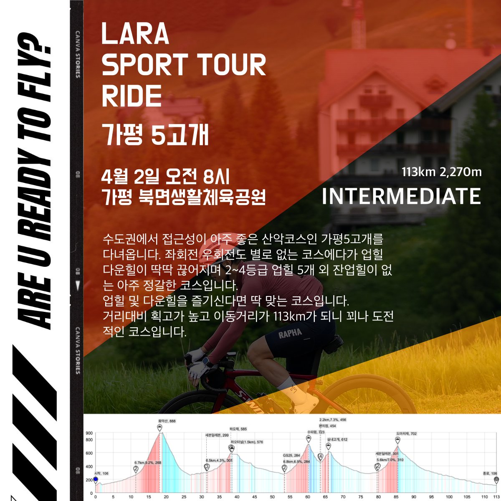
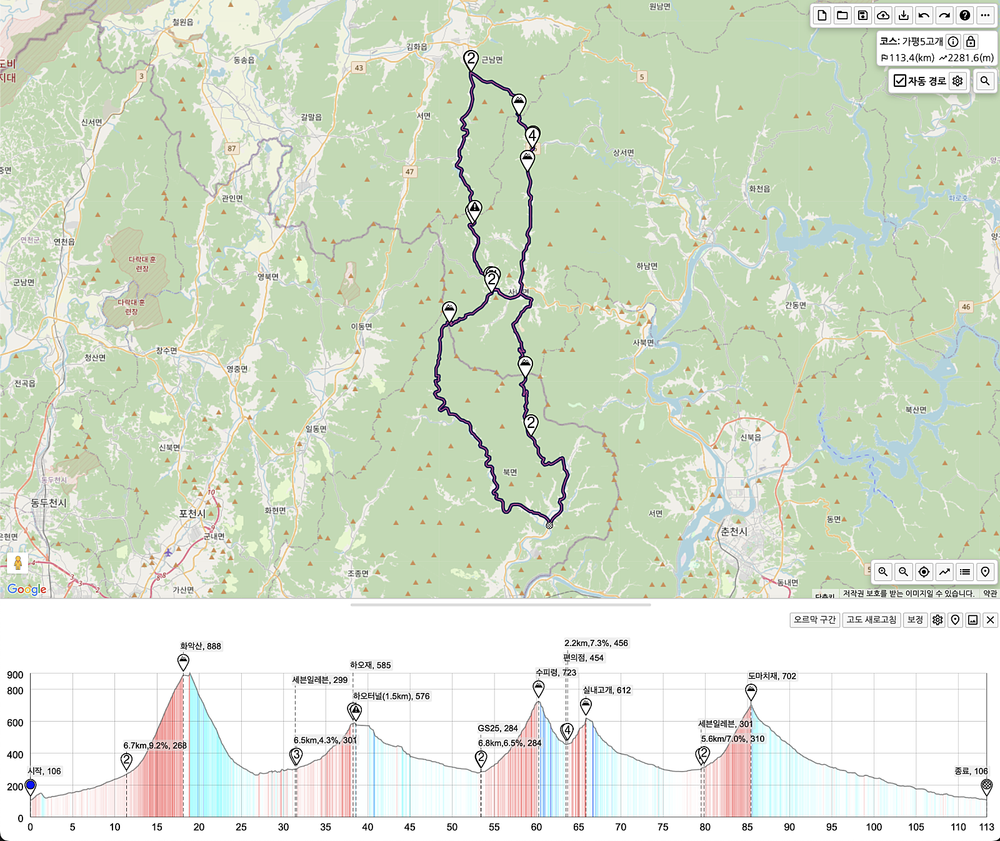

모임일시 : 4월 2일 수요일 / 08시 00분~ 

모임장소 : 가평 북면생활체육공원

인원제한 : -

비상연락 : petermoon87(kakaotalk)

운용속도 : 33-38 (지속주 선두추월가능)

로테여부 : 선택

거리/획고 : 거리 113km / 획득고도 2,270m

코스맵 : https://ridingazua.cc/c/149920

상세설명 :   
수도권에서 접근성이 아주 좋은 산악코스인 가평5고개를 다녀옵니다. 좌회전 우회전도 별로 없는 코스에다가 업힐 다운힐이 딱딱 끊어지며 2~4등급 업힐 5개 외 잔업힐이 없는 아주 정갈한 코스입니다.
업힐 및 다운힐을 즐기신다면 딱 맞는 코스입니다.
거리대비 획고가 높고 이동거리가 113km가 되니 꾀나 도전적인 코스입니다.
그럼 레츠꼬👉👉👉  

코스수준: ★★★★☆ 획고와 거리가 높습니다.  
코스강도: ★★★★☆ 평지가 거의 없습니다.

### 참석 전 안내사항
1. 중급자를 위한 라이드입니다. 
2. 운용속도 [33-38] 은 리밋 아닙니다. 무풍평지선두항속 기준이며 바람, 경사, 기타 상황에 따라 넘나들 수 있습니다.
3. 코스파일을 컴퓨터에 넣어오시거나 꼭 숙지해주세요.

### 참석자 안내사항
1. 입, 팔꿈치 신호 해주세요
2. 가감속시 부드럽게 해주세요
3. 라인 안겹치게 조심해주세요
4. 모임시간을 준수해주세요. 
5. 행인, 운전자 및 라이더에게 양보, 친절을 배풉니다.
6. 오픈구간 외 강한 인터벌 금지합니다.

### 예상일정
08:00 브리핑 및 출발  
14:30 라이딩종료  

## 라이딩 후 식당
화악리닭갈비막국수 - https://naver.me/5oQi4EZY

## 지난벙 후기 참고
2024-10-16(수) 가평5고개 사진후기 및 정산📸💸  
https://cafe.naver.com/clublara/19910

### 코스파일
[가평5고개.tcx](./가평5고개.tcx)  
[가평5고개.gpx](./가평5고개.gpx)

### 이미지 자료
