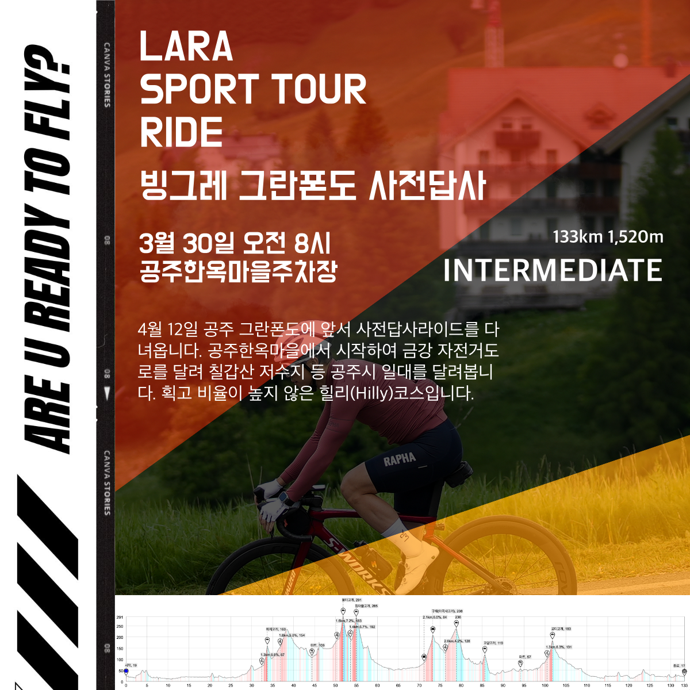

모임일시 : 3월 30일 일요일 / 08시 00분~

모임장소 : 공주, 한옥마을주차장

인원제한 : -

비상연락 : petermoon87(kakaotalk)

운용속도 : 33-40 (로테 선택, 업힐 오픈)

거리/획고 : 133km 1,520m (6시간 소요 예정)

코스맵 : 라이딩가즈아 - https://ridingazua.cc/c/164149

주요코스: 공주시 일대, 칠갑산 저수지 등, 44km 마트, 94km 편의점, 133km 종료

상세설명 : 

4월 12일 공주 그란폰도에 앞서 사전답사라이드를 다녀옵니다. 공주한옥마을에서 시작하여 금강 자전거도로를 달려 칠갑산 저수지 등 공주시 일대를 달려봅니다. 획고 비율이 높지 않은 힐리(Hilly)코스입니다.
그럼 레츠꼬👉👉👉

### 참석 전 안내사항
1. 중급자를 위한 라이드입니다. 
2. 운용속도 [33-40] 은 리밋 아닙니다. 무풍평지선두항속 기준이며 바람, 경사, 기타 상황에 따라 넘나들 수 있습니다.
3. 코스파일을 컴퓨터에 넣어오시거나 꼭 숙지해주세요.

### 참석자 안내사항
1. 입, 팔꿈치 신호 해주세요
2. 가감속시 부드럽게 해주세요
3. 라인 안겹치게 조심해주세요
4. 모임시간을 준수해주세요. 
5. 행인, 운전자 및 라이더에게 양보, 친절을 배풉니다.
6. 오픈구간 외 강한 인터벌 금지합니다.

### 집결 & 주차위치  
충청남도 공주시 웅진동 336-3  
네이버지도 - 공주한옥마을주차장  
https://naver.me/xdp7YbEj

### 공주시 날씨 확인하기  
https://weather.naver.com/compare/15150101

### 코스파일  
[빙그레그란폰도_사전답사.tcx](./빙그레그란폰도_사전답사.tcx)  
[빙그레그란폰도_사전답사.gpx](./빙그레그란폰도_사전답사.gpx)  

### 이미지 자료
  
