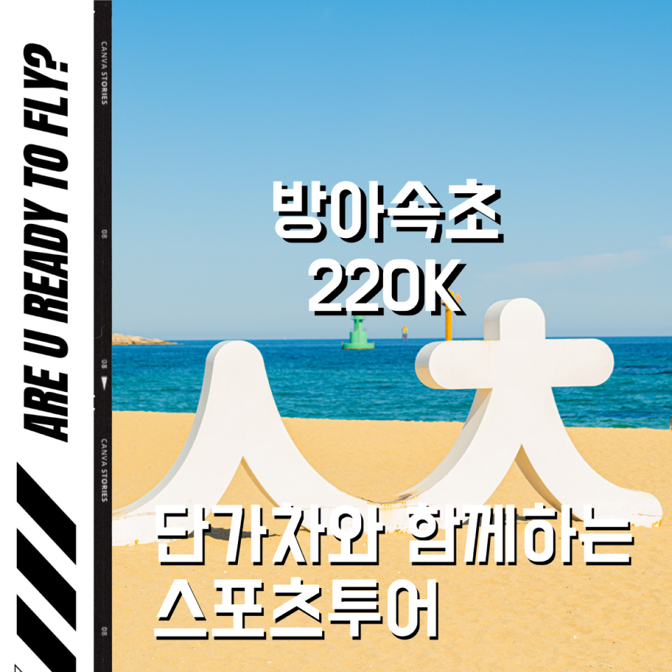
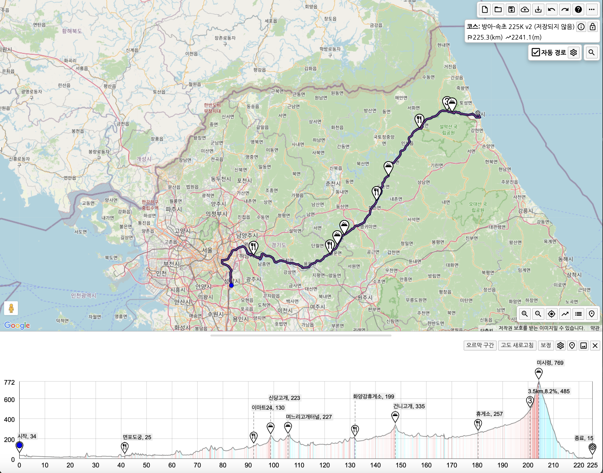

모임일시 : 3월 9일 일요일 / 06시 00분~ 

모임장소 : 방아교 서편

주행등급 : 중급

인원제한 : 8

비상연락 : petermoon87(kakaotalk)

운용속도 : 33-36 장거리 지속주 노인터벌 평지무풍항속기준. 경사, 바람에 따라 속도는 유동적, 드레프팅 
안되시면 힘듭니다.

로테여부 : 권장

거리/획고 : (거리 200km / 획득고도 1,800m)

코스맵 : 하단참고

소요시간: 약 10시간 (휴식시간 포함)

상세설명 : 

지난 11월에 역풍 씨게맞으면서 갔는데 이번엔 순풍이겠져~?ㅎㅎ 몸올리러 속초갑니다~! 작년 11월 속초 그대로 진행해보겠습니다. 그럼 아래 복붙합니다!  

코스는 미시령 말고는 평지코스입니다. 중간중간 작은 언덕들이 있어서 심심하지않아요. 팔당유원지부터 공도를 이용하며 미시령을 넘어 속초시외터미널까지 갑니다.  

인터벌없이 라라등급표 기준 35km/h 정도 생각하시면 되구요. 선두 안스셔도 되니 뒤에서만 붙어오실분을 참석란에 적어주세요~! 그룹라이딩에 익숙하신 분만 참석바랍니다. 중간 식사(수저가 있는)는 없습니다. 휴계시간 포함 8시간~10시간 예상됩니다.  

인터벌 없도록 제가 적극적으로 페이스 관리할 예정이구요. 문제가 생길경우 개별복귀하셔야합니다. 복귀는 버스를 이용합니다.  

레츠 꼬! 👉👉👉

위험요소는 꼭 팔꿈치와 입으로 신호합니다. 
모임시간을 준수해주세요.  
행인, 운전자 및 라이더에게 양보, 친절해주세요.  
전조등, 후미등 챙겨주세요.  

### 보급 정보
1. 41km 면포도궁
2. 92km(↔51km) 편의점
3. 132km(↔40km) 화양강휴게소
4. 180km(↔48km) 설악휴게소
5. 225km(↔45km) 도착

### 코스 정보
라이딩가즈아! - https://ridingazua.cc/c/155690

### 지난 라이드 후기
9/8 춘천속초 벙 진행후기 및 정산📝💸 - https://cafe.naver.com/clublara/19135

### 코스파일
[춘천_속초_187K.tcx](./춘천_속초_187K.tcx)  
[춘천_속초_187K.gpx](./춘천_속초_187K.gpx)  

### 이미지 자료
  