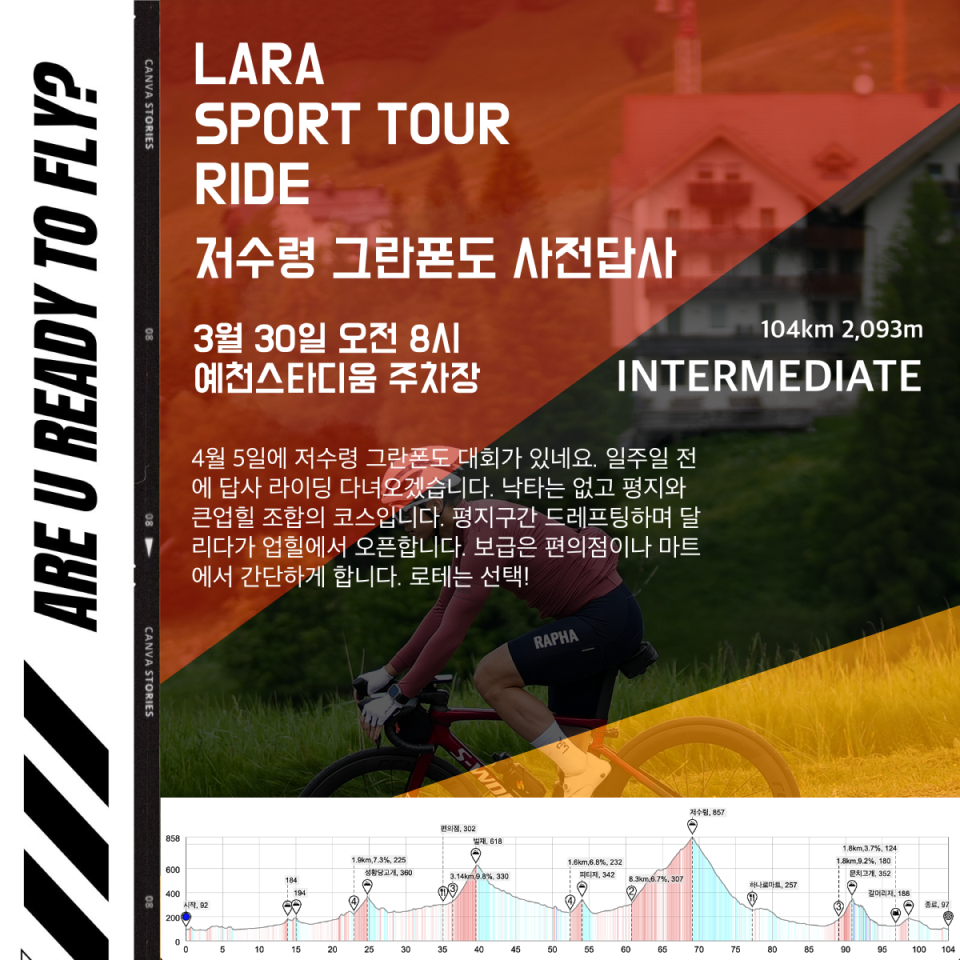
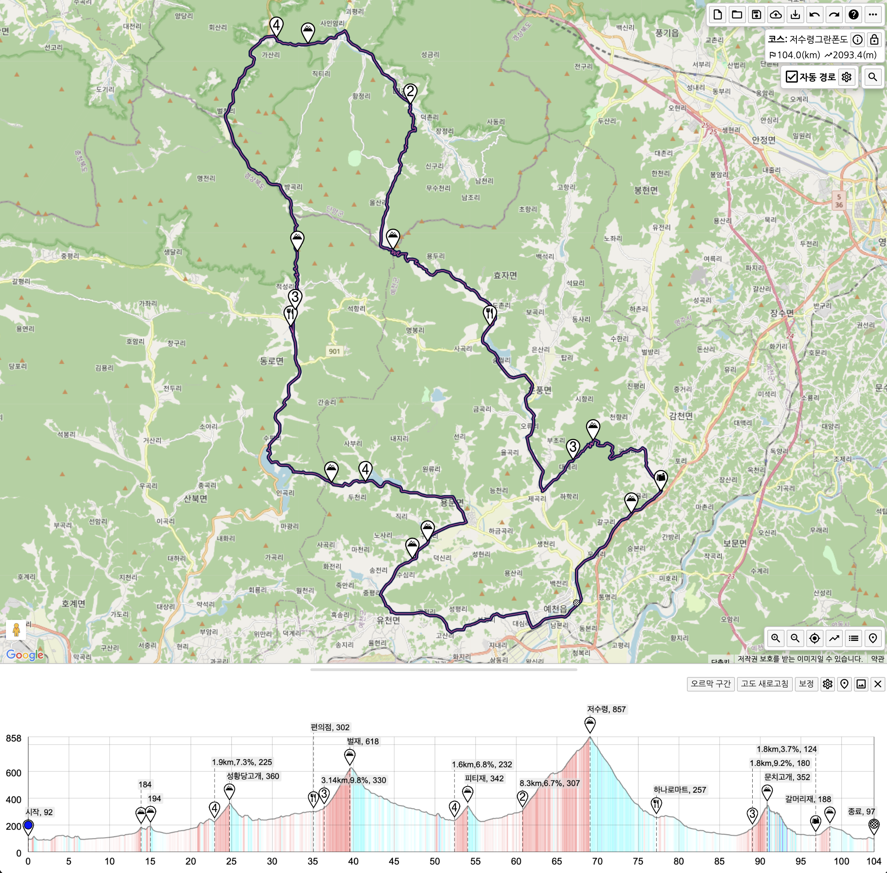

모임일시 : 3월 30일 일요일 / 08시 00분~ 

모임장소 : 예천스타디움 주차장

인원제한 : 6 x 2

비상연락 : petermoon87(kakaotalk)

운용속도 : 33-38

로테여부 : 선택

후미관리 : 지속주로 이동, 업힐 오픈, 정상에서 붙힘

거리/획고 : 104km 2,093m

코스맵 : 하단 첨부

상세설명 : 

4월 5일에 저수령 그란폰도 대회가 있네요. 일주일 전에 답사 라이딩 다녀오겠습니다. 낙타는 없고 평지와 큰업힐 조합의 코스입니다. 평지구간 드레프팅하며 달리다가 업힐에서 오픈합니다. 보급은 편의점이나 마트에서 간단하게 합니다.
로테는 선택!

### 참석 전 안내사항
1. 중급자를 위한 라이드입니다. 
2. 운용속도 [33-38] 은 리밋 아닙니다. 무풍평지선두항속 기준이며 바람, 경사, 기타 상황에 따라 넘나들 수 있습니다.
3. 코스파일을 컴퓨터에 넣어오시거나 꼭 숙지해주세요.

### 참석자 안내사항
1. 입, 팔꿈치 신호 해주세요
2. 가감속시 부드럽게 해주세요
3. 라인 안겹치게 조심해주세요
4. 모임시간을 준수해주세요. 
5. 행인, 운전자 및 라이더에게 양보, 친절을 배풉니다.
6. 오픈구간 외 강한 인터벌 금지합니다.

### 코스정보
라이딩가즈아: https://ridingazua.cc/c/165373

### 참고용
예천스타디움 (주차, 집합장소)  
네이버 지도: https://naver.me/Gxkiv2nQ  
산호식당 (라이딩 후 식당)  
네이버지도: https://naver.me/FTXuHP15  

### 코스파일  
[저수령그란폰도.tcx](./저수령그란폰도.tcx)  
[저수령그란폰도.gpx](./저수령그란폰도.gpx)  

### 이미지자료
  
