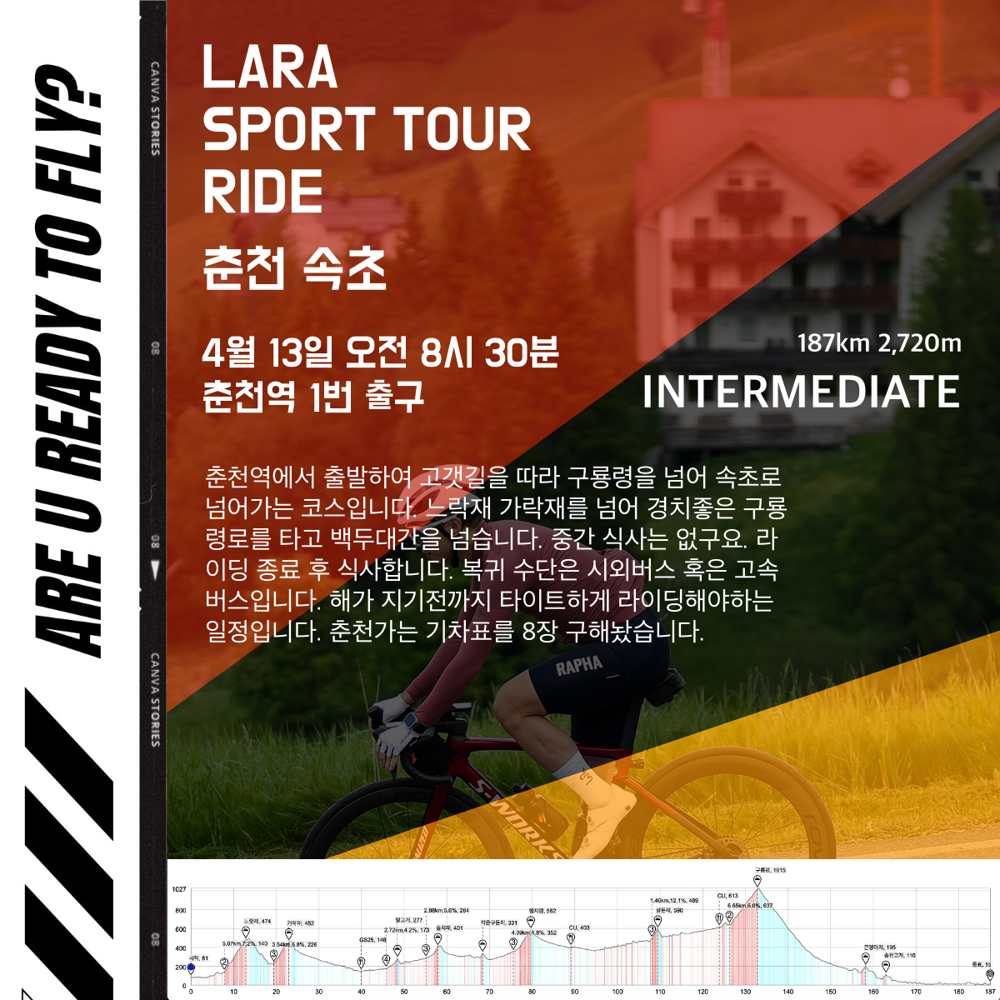
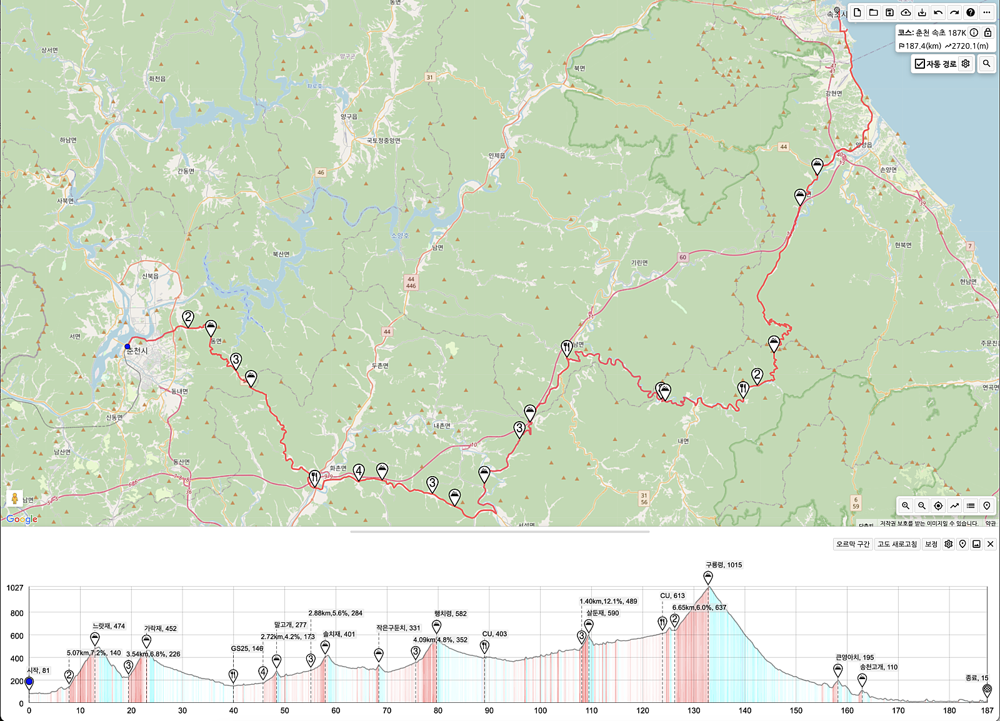

모임일시 : 4월 13일 일요일 / 08시 30분~ 

모임장소 : 춘천역 1번 출구

인원제한 : 8

비상연락 : petermoon87(kakaotalk)

운용속도 : 33-38 (업힐 외 지속주)

로테여부 : 선택

거리/획고 : 187km 2,720m

코스맵 : 꼭 넣어오세요

상세설명 : 
춘천역에서 출발하여 고갯길을 따라 구룡령을 넘어 속초로 넘어가는 코스입니다. 느락재 가락재를 넘어 경치좋은 구룡령로를 타고 백두대간을 넘습니다. 중간 식사는 없구요. 라이딩 종료 후 식사합니다. 복귀 수단은 시외버스 혹은 고속버스입니다.
춘천가는 첫차 기차표를 8장 구해놨습니다.
해가 지기전까지 타이트하게 라이딩해야하는 일정입니다. 

혹시 대기가 많으면 버스대절 고려 하겠습니다.

### 중요 시간표
06:04 이매역 분당선 왕십리행 탑승
07:09 왕십리역 ITX 탑승
08:30 춘천역 라이딩 출발
17:30 속초 도착 및 종료
19:00 성남행 막차(동서울행은 많음)

### 경로 정보
https://ridingazua.cc/c/142075

### 식당
남경막국수 본점 - https://naver.me/IMQnwBbV

### 지난 라이드 후기
9/8 춘천속초 벙 진행후기 및 정산📝💸 - https://cafe.naver.com/clublara/19135

### 코스파일
[춘천_속초_187K.tcx](./춘천_속초_187K.tcx)  
[춘천_속초_187K.gpx](./춘천_속초_187K.gpx)  

### 이미지 자료
  
